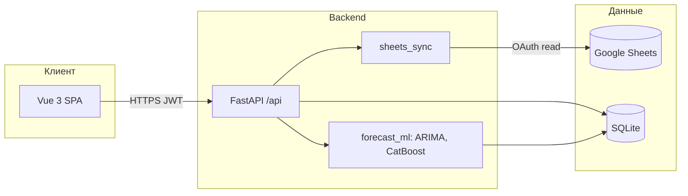
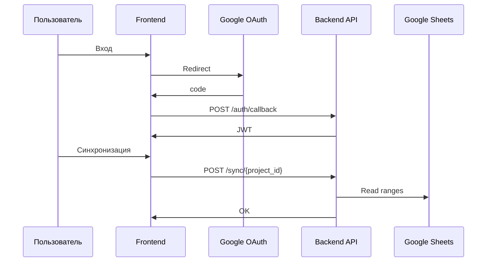
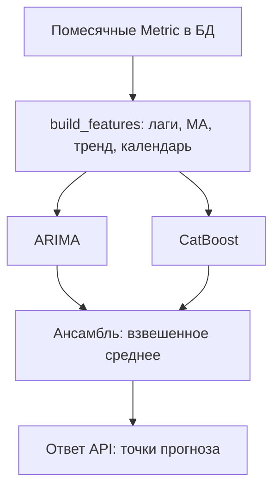
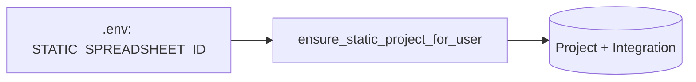

# EcomProfit Guard

Веб-система анализа и прогнозирования рентабельности коммерческих (ecom) проектов: синхронизация с Google Таблицами, дашборд, аналитика, алерты и ML-прогноз (ARIMA, CatBoost, ансамбль).

---

## Содержание

- [Возможности](#возможности)
- [Стек технологий](#стек-технологий)
- [Требования](#требования)
- [Структура репозитория](#структура-репозитория)
- [Диаграммы архитектуры](#диаграммы-архитектуры)
- [Быстрый старт](#быстрый-старт)
- [Переменные окружения](#переменные-окружения)
- [Настройка Google Cloud (OAuth)](#настройка-google-cloud-oauth)
- [Использование](#использование)
- [Данные в Google Таблице](#данные-в-google-таблице)
- [Соответствие колонок листов](#соответствие-колонок-листов)
- [API](#api)
- [Тестирование](#тестирование)
- [Реализовано vs запланировано (НИР)](#реализовано-vs-запланировано-нир)
- [Документация и сдача задания 5П](#документация-и-сдача-задания-5п)

---

## Возможности

| Модуль | Описание |
|--------|----------|
| **Дашборд** | Выручка, затраты, прибыль, рентабельность, топы проектов, специалистов и подразделений за период |
| **Аналитика** | Группировки по месяцам, кварталам, годам; разрезы по проектам, клиентам, специалистам, отделам |
| **Алерты** | Низкая рентабельность (ниже порога), просроченные оплаты по актам; пересчёт вручную |
| **Прогноз** | Помесячные метрики, признаки (лаги, скользящие средние, тренды и др.), модели ARIMA, CatBoost, ансамбль; горизонт до 12 месяцев |

---

## Стек технологий

| Слой | Технологии |
|------|------------|
| **Backend** | Python 3.11+, FastAPI, Uvicorn, SQLAlchemy 2 (async), SQLite (aiosqlite) |
| **Данные** | Google Sheets API, OAuth 2.0 |
| **ML** | statsmodels (ARIMA), CatBoost, pandas, NumPy |
| **Frontend** | Vue 3, Vite, Pinia, Vue Router, Tailwind CSS, Chart.js (vue-chartjs) |
| **Аутентификация** | Google OAuth 2.0, JWT |

---

## Диаграммы архитектуры

Диаграммы в формате **Mermaid** отображаются на GitHub и в многих редакторах Markdown.

### Общая схема системы



### Поток авторизации и синхронизации



### Конвейер прогноза рентабельности



### Статический проект (одна таблица)



---

## Требования

- **Python** 3.11 или новее  
- **Node.js** 18+ (для сборки фронтенда; актуальная LTS предпочтительна)  
- Аккаунт **Google** и проект в **Google Cloud Console** (для OAuth и доступа к таблицам)  
- Доступ на **чтение** к используемым Google Таблицам у того аккаунта, под которым выполняется вход в приложение  

---

## Структура репозитория

```
diplom_final/
├── backend/                 # FastAPI-приложение
│   ├── app/
│   │   ├── main.py
│   │   ├── routers/
│   │   ├── services/      # в т.ч. sheets_sync, forecast_ml
│   │   └── models/
│   ├── requirements.txt
│   └── tests/
├── frontend/                # Vue 3 SPA
│   ├── src/
│   └── package.json
├── .env.example             # образец переменных окружения
├── README.md
└── docs/                    # отчёт по НИР/5П, testing/, …
```

---

## Быстрый старт

### 1. Клонирование и окружение

```bash
git clone <URL-репозитория>
cd diplom_final
```

### 2. Backend

```bash
cd backend
python -m venv .venv
```

**Windows (cmd):** `backend\.venv\Scripts\activate`  
**Windows (PowerShell):** `backend\.venv\Scripts\Activate.ps1`  
**Linux / macOS:** `source backend/.venv/bin/activate`

```bash
cd backend
pip install -r requirements.txt
```

Скопируйте пример конфигурации и заполните секреты (см. [Переменные окружения](#переменные-окружения) и [Настройка Google Cloud](#настройка-google-cloud-oauth)):

```bash
# из каталога backend:
copy ..\.env.example .env
# Linux/macOS: cp ../.env.example .env
```

Запуск API (по умолчанию порт **8000**):

```bash
uvicorn app.main:app --reload --host 0.0.0.0 --port 8000
```

### 3. Frontend

```bash
cd frontend
npm install
npm run dev
```

Откройте в браузере: **http://localhost:5173**

### 4. Типовой сценарий

1. Войти через Google.  
2. При **режиме статического проекта** (`STATIC_PROJECT_ENABLED=true` в `.env`) таблица задаётся на сервере: откройте **«Синхронизация»** и нажмите **«Синхронизировать»**. Иначе создайте проект вручную и укажите ссылку на Google Таблицу.  
3. При необходимости снова выполните синхронизацию после изменений в таблице.  
4. Просмотрите дашборд, аналитику, алерты, прогноз.  

---

## Переменные окружения

Файл **`backend/.env`** (или **`.env`** в корне при согласованной конфигурации) задаётся на основе [`.env.example`](.env.example). Основные переменные:

| Переменная | Назначение |
|------------|------------|
| `DATABASE_URL` | Строка подключения SQLAlchemy (по умолчанию SQLite) |
| `SECRET_KEY` | Секрет для подписи JWT; в продакшене — длинная случайная строка |
| `GOOGLE_CLIENT_ID` | Client ID из Google Cloud Console |
| `GOOGLE_CLIENT_SECRET` | Client Secret из Google Cloud Console |
| `REDIRECT_URI` | URI перенаправления OAuth; должен **точно** совпадать с указанным в консоли (например `http://localhost:5173/auth/callback`) |
| `BACKEND_URL` | Базовый URL API (например `http://localhost:8000`) |
| `FRONTEND_URL` | Базовый URL фронтенда (например `http://localhost:5173`) |
| `FORECAST_MIN_MONTHS_HISTORY` | Минимум месяцев истории для полноценного прогноза (по умолчанию 12) |
| `DEFAULT_PROFITABILITY_THRESHOLD_PCT` | Порог рентабельности для алертов (по умолчанию 15) |
| `STATIC_PROJECT_ENABLED` | `true` — одна фиксированная таблица на пользователя; создание/редактирование проектов в API отключено |
| `STATIC_SPREADSHEET_ID` | ID документа Google Sheets (из URL между `/d/` и `/edit`) |
| `STATIC_SHEET_ACTS`, `STATIC_SHEET_COSTS`, `STATIC_SHEET_SPECIALISTS`, `STATIC_SHEET_METRICS` | Имена листов |
| `STATIC_PROJECT_NAME` | Отображаемое имя проекта в списке |

**Важно:** не коммитьте `.env` с реальными секретами в публичный репозиторий. Значения `GOOGLE_CLIENT_ID` и `GOOGLE_CLIENT_SECRET` храните только локально или в защищённом хранилище секретов CI/CD.

---

## Настройка Google Cloud (OAuth)

Кратко: создайте проект в [Google Cloud Console](https://console.cloud.google.com/), включите **Google Sheets API** (и при необходимости **Google People API** для профиля пользователя), настройте **OAuth consent screen**, создайте учётные данные типа **OAuth 2.0 Client ID** для **Web application** и добавьте в **Authorized redirect URIs** тот же URI, что в `REDIRECT_URI` (например `http://localhost:5173/auth/callback`).

### Пошагово

1. **Проект** — создать и выбрать в консоли.  
2. **APIs & Services → Library** — включить **Google Sheets API**; по желанию **Google People API**.  
3. **OAuth consent screen** — тип пользователей (часто External), заполнить название приложения, email поддержки; на шаге **Scopes** добавить:  
   - `https://www.googleapis.com/auth/spreadsheets.readonly`  
   - `https://www.googleapis.com/auth/userinfo.email`  
   - `https://www.googleapis.com/auth/userinfo.profile`  
   В режиме тестирования добавьте тестовых пользователей (свой Google-email).  
4. **Credentials → Create credentials → OAuth client ID** — тип **Web application**; в **Authorized redirect URIs** добавить URI callback фронтенда.  
5. Скопировать **Client ID** и **Client secret** в `.env` как `GOOGLE_CLIENT_ID` и `GOOGLE_CLIENT_SECRET`.  

После входа пользователь даёт доступ к таблицам своего аккаунта; таблицы должны быть доступны этому аккаунту на чтение.

---

## Использование

- **Период на дашборде** задаётся датами начала и конца.  
- **Выручка** может подтягиваться с эталонного листа TL/«Специалисты» (см. ниже), иначе — из актов по правилам дат.  
- **Затраты** — сумма по листу «Затраты» за период.  
- **Прогноз** — раздел «Прогноз рентабельности»: выбор проекта, модели (`arima`, `catboost`, `ensemble`) и горизонта (до 12 месяцев). Для устойчивого обучения нужна история помесячных метрик (не менее порога из `FORECAST_MIN_MONTHS_HISTORY`).  
- **Размытие персональных данных (NDA):** включается константой `BLUR_PERSONAL_DATA` в `frontend/src/config/privacy.js` (`true` — размытие имён и подстановка «Проект №…» в селектах; `false` — полные подписи). Пересоберите фронт после изменения. В UI переключателя нет.

---

## Данные в Google Таблице

| Лист | Роль в системе |
|------|----------------|
| **Акты** | Доходы (выручка, акты выполненных работ) → участвует в расчёте выручки и метрик |
| **Затраты** | Расходы → «Затраты» на дашборде |
| **TL / Специалисты** (или согласованное имя в настройках проекта) | Эталонная выручка по месяцам (строки 66 / 139 / 160 для лет 2024–2026, колонки C–N); колонка **Итого** — P |
| **Метрики** (опционально) | Год, месяц, выручка, затраты и др.; при отсутствии метрики могут считаться из актов и затрат за последние 2 года |

Подключение: URL таблицы в настройках проекта в приложении.

**Тестовая таблица (пример):** [Income для университета](https://docs.google.com/spreadsheets/d/1bthYq25QYuM-AM-UALOIcP6U0oTgoGIUWXZbFWQrQRg/edit) — листы «Акты», «Затраты», «TL / Специалисты» (имя листа с пробелами указать в интеграции проекта).

---

## Соответствие колонок листов

Ниже — ориентир для сопоставления с вашей таблицей (буквы колонок — как в типовом шаблоне проекта). Рентабельность в приложении считается по формулам из фактических сумм, если отдельные колонки «план/факт» не заданы.

### Лист «Акты»

| Колонка | Поле (смысл) |
|---------|----------------|
| B | Цех |
| C | Подразделение цеха |
| F | Клиент |
| G | Проект (название) |
| I | Договор / ДС / Заказ |
| J | Статус документов |
| K | Задача |
| N | Специалист |
| O | Часы |
| P | Ставка |
| Q | Сумма отгрузки / выручка (без НДС) |
| S | Сумма оплаты с НДС |
| V | Ожидание оплаты |
| W | Дата оплаты |
| X | Статус счёта |
| Y | Дата отгрузки (приоритет для отнесения выручки ко времени поступления денег) |
| Z | Дата акта |
| AA | Статус акта |
| AB | Ожидание отгрузки |
| AD | Долги по отгрузке |

### Лист «TL / Специалисты»

| Колонка | Поле (смысл) |
|---------|----------------|
| A | Год |
| B | ФИО специалиста |
| C–N | Месяцы (подписи в строке 2) |
| P | Итого |

Эталонная выручка по месяцам для дашборда: строка **66** (2024), **139** (2025), **160** (2026), диапазон **C–N**.

### Лист «Затраты»

| Колонка | Поле (смысл) |
|---------|----------------|
| A | Цех |
| B | Категория |
| C | Тег |
| E | Клиент / контрагент |
| F | Проект |
| H | Задача / назначение |
| L | Специалист |
| N | Сумма затраты |
| O | Сумма оплаты |
| P | Дедлайн оплаты |
| Q | Дата оплаты |
| R | Статус оплаты |
| T | Дата затраты |
| U | Месяц затраты |
| V | Долги по затрате |

---

## API

После запуска backend интерактивная документация OpenAPI (Swagger UI) обычно доступна по адресу:

**http://localhost:8000/docs**

Эндпоинты включают авторизацию, проекты, дашборд, синхронизацию, прогноз и др. (см. теги в Swagger).

---

## Тестирование

### Автотесты backend

После установки зависимостей (`pip install -r requirements.txt`) запускайте тесты через интерпретатор — так не зависит от того, добавлен ли каталог `Scripts` в `PATH` (типичная ситуация в PowerShell на Windows):

```bash
cd backend
.venv\Scripts\python -m pytest -v
```

На Linux/macOS: `source .venv/bin/activate` и затем `python -m pytest -v`.

Пакет `pytest` указан в `requirements.txt`.

### Первичное тестирование для отчёта (5П)

В каталоге **[docs/testing/](docs/testing/README.md)**:

| Артефакт | Файл / папка |
|----------|----------------|
| Метрики ML и чек-лист UI | [docs/testing/metrics.md](docs/testing/metrics.md) |
| Пример ответа API прогноза | [docs/testing/logs/example_forecast_response.json](docs/testing/logs/example_forecast_response.json) |
| Скриншоты интерфейса | `docs/testing/screenshots/` (PNG по чек-листу в README каталога) |

Перед сдачей заполните таблицы в `metrics.md`, добавьте скриншоты и при необходимости экспорт логов (без секретов).

---

## Реализовано vs запланировано (НИР)

Сводные таблицы, прогнозирование, план/факт рентабельности и выводы — в едином отчёте:

**[docs/Otchet_pervichnoe_testirovanie_i_sravnenie_s_planom_NIR.md](docs/Otchet_pervichnoe_testirovanie_i_sravnenie_s_planom_NIR.md)** (разделы 6.1–6.6).

---

## Документация и сдача задания 5П

| Документ | Назначение |
|----------|------------|
| [docs/Otchet_pervichnoe_testirovanie_i_sravnenie_s_planom_NIR.md](docs/Otchet_pervichnoe_testirovanie_i_sravnenie_s_planom_NIR.md) | Отчёт: первичное тестирование, метрики, соответствие плану НИР |
| [docs/testing/](docs/testing/README.md) | Метрики, скриншоты, примеры логов API |


