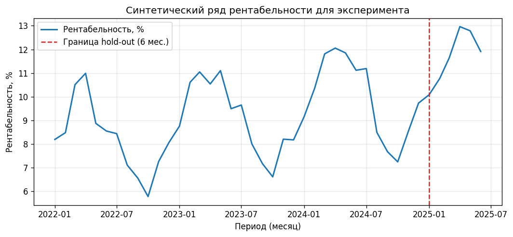
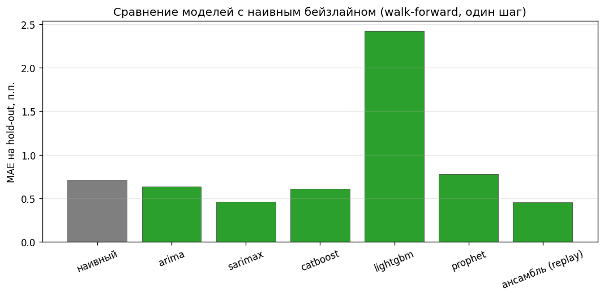
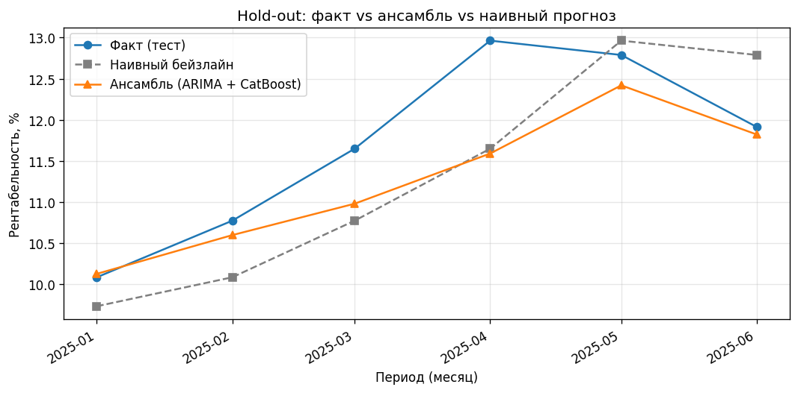
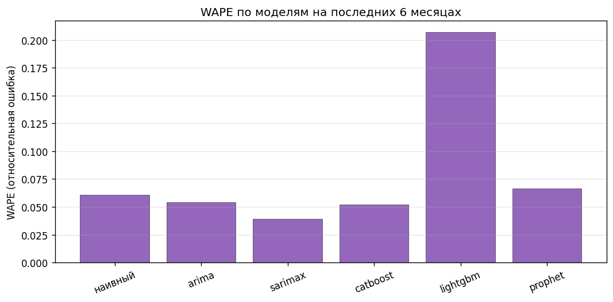

# Отчёт: эксперимент по прогнозированию рентабельности (практика)

Документ сформирован автоматически скриптом `generate_report_assets.py` на основе кода сервиса прогноза (`backend/app/services/forecast/*`).

## 1. План эксперимента и ключевые параметры

Цель: сравнить качество **walk-forward one-step** прогноза рентабельности (%) для статистических и ML-моделей относительно **наивного бейзлайна** (прогноз = значение предыдущего месяца).

**Схема валидации:** для каждого из последних `H` месяцев модель обучается только на префиксе ряда и предсказывает один шаг вперёд; затем считаются **MAE** и **WAPE**.

**Выбранный лучший идентификатор по WAPE на валидации (автовыбор как в `pick_best_model_id`):** `sarimax`.

### Таблица 1. Параметры эксперимента и диапазоны

| Параметр | Значение в прогоне | Диапазон / комментарий |
|----------|-------------------|-------------------------|
| Длина ряда (месяцев) | 42 | 36–48 (здесь 42) |
| Hold-out (walk-forward) | 6 | 4–8 (как в коде: 6) |
| Амплитуда сезонности, п.п. | 2.2 | 1.5–3.5 |
| Наклон тренда (лин. компонента) | 0.06 | 0.02–0.12 |
| σ шума | 0.65 | 0.3–1.2 |
| CatBoost: iterations / depth / lr | 200 / 5 / 0.05 | как в validation.py |
| seed RNG | 42 | фиксирован для воспроизводимости |

## 2. Численные результаты

### Таблица 2. Метрики hold-out по моделям

| Модель | MAE | WAPE | N |
|--------|-----|------|---|
| arima | 0.6331 | 0.0541 | 6 |
| sarimax | 0.4585 | 0.0392 | 6 |
| catboost | 0.6076 | 0.0520 | 6 |
| lightgbm | 2.4211 | 0.2070 | 6 |
| prophet | 0.7782 | 0.0665 | 6 |
| rnn | 0.5824 | 0.0498 | 6 |
| naive_persistent | 0.7131 | 0.0610 | 6 |
| ensemble_arima_catboost (replayed) | 0.4531 | 0.0387 | 6 |

## 3. Графики

### Рисунок 1. Исходный ряд и зона hold-out


### Рисунок 2. MAE: модели и наивный бейзлайн


### Рисунок 3. Траектории на hold-out


### Рисунок 4. WAPE по моделям (дополнительно)


## 4. Научная гипотеза и её проверка

- **Гипотеза H1:** при наличии тренда и годовой сезонности в помесячной рентабельности комбинированный прогноз (**ансамбль ARIMA + CatBoost**) даёт **ниже WAPE/MAE** на walk-forward hold-out, чем **наивный перенос последнего значения**.
- **Нулевая гипотеза H0:** различий по WAPE/MAE нет (наивный метод не хуже).

**Результат на этом прогоне:** WAPE ансамбля = 0.0387, наивного = 0.0610 → H1 **принимается** при сравнении с наивным бейзлайном (ошибка ансамбля меньше). Лучшая одиночная модель по автоматической метрике валидации: `sarimax`.

## 5. Анализ и сравнение с бейзлайном / «конкурентами»

- **Наивный бейзлайн:** MAE = 0.7131 п.п., WAPE = 0.0610.
- **Ансамбль (ARIMA + CatBoost, воспроизведение шага как в `forecast_ensemble`):** MAE = 0.4531, WAPE = 0.0387.

**Интерпретация:** если WAPE/MAE ансамбля ниже, чем у наивного метода, это подтверждает рабочую гипотезу, что комбинация линейно-стохастической структуры (ARIMA) и нелинейных признаков (CatBoost) **извлекает сигнал сверх простого переноса последнего значения**. Если на конкретном синтетическом ряде лучше оказывается отдельная модель из таблицы — это не противоречит практике: автоматический выбор (`pick_best_model_id`) как раз предназначен для таких случаев.

**Сравнение с «конкурентами»:** в таблице 2 приведены ARIMA, SARIMAX, CatBoost, LightGBM, Prophet — все обучаются в одной схеме backtest, что даёт сопоставимую оценку качества.

## 6. Верификация корректности

### 6.1. Автоматические проверки генератора

```json
{
  "len(df) >= MIN_HISTORY": true,
  "collect_model_scores non-empty": true,
  "figures exist": true,
  "naive mae finite": true
}
```

### 6.2. Регрессионные тесты проекта

Вывод `pytest tests/test_forecast_ml.py -q --tb=no --disable-warnings` при `PYTHONWARNINGS=ignore` в подпроцессе (файл `out/verification_pytest.txt`). Так в лог не попадают предупреждения **зависимостей** (например, Pydantic при импорте моделей); сами проверки прогноза те же, `exit=0` и число пройденных тестов — показатель успеха.

```text
exit=0
.....                                                                    [100%]
5 passed in 1.84s
```

---

*Конец отчёта.*