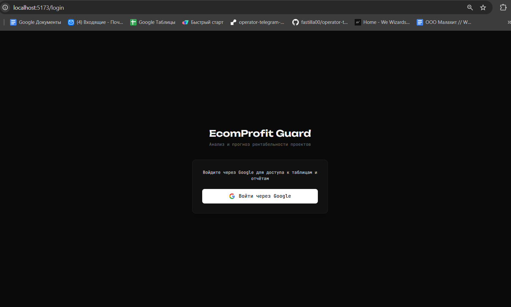
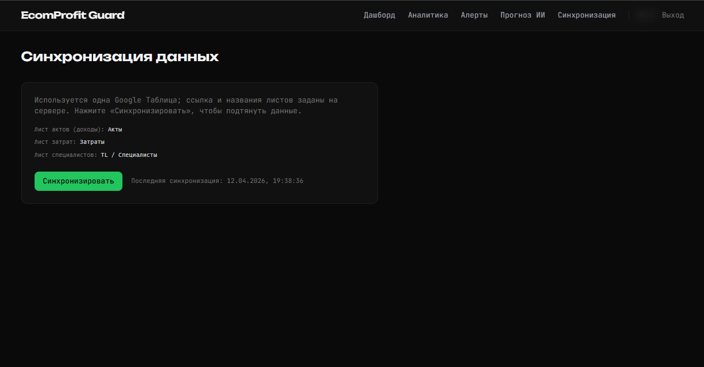
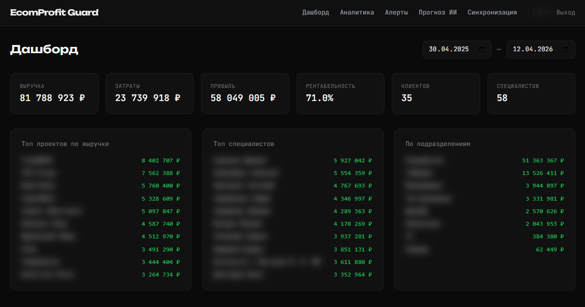
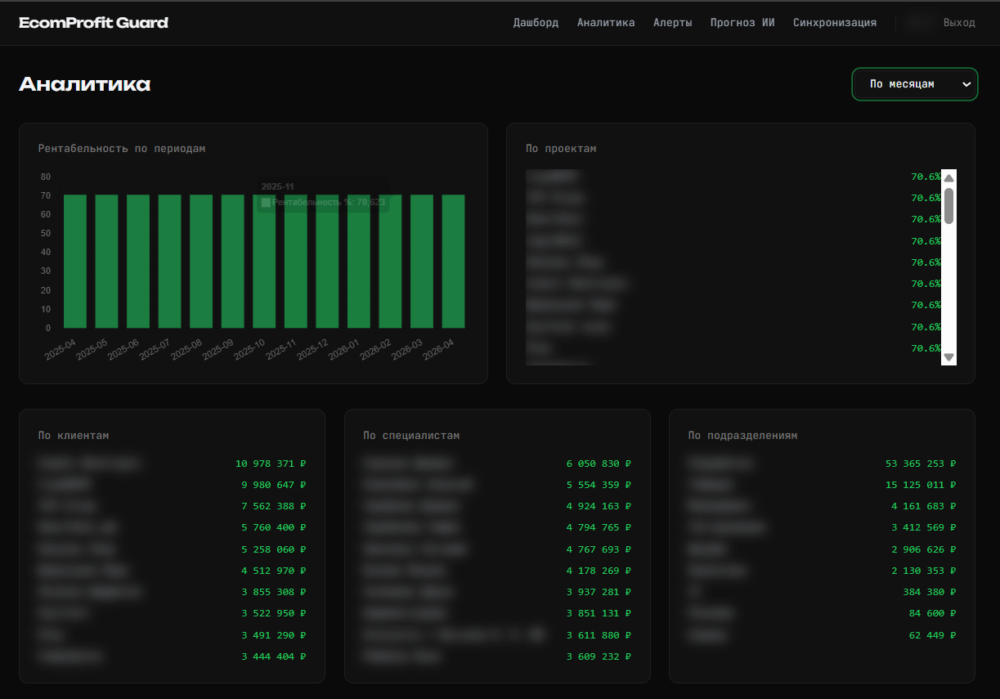
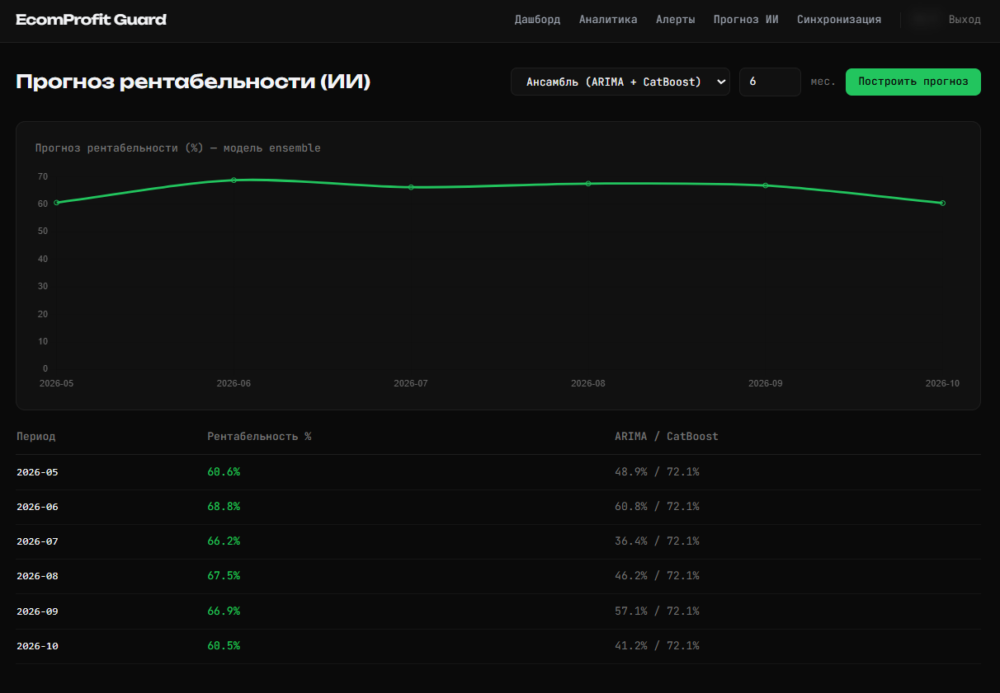
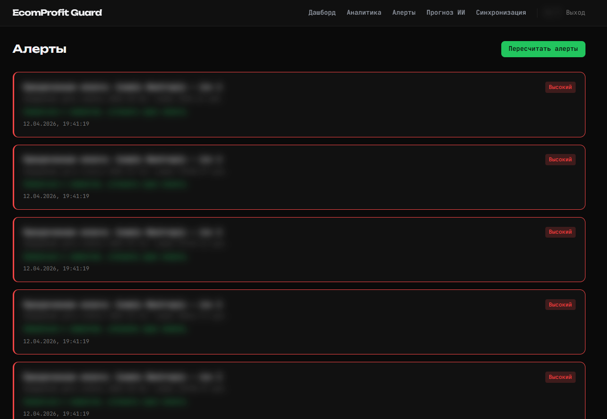
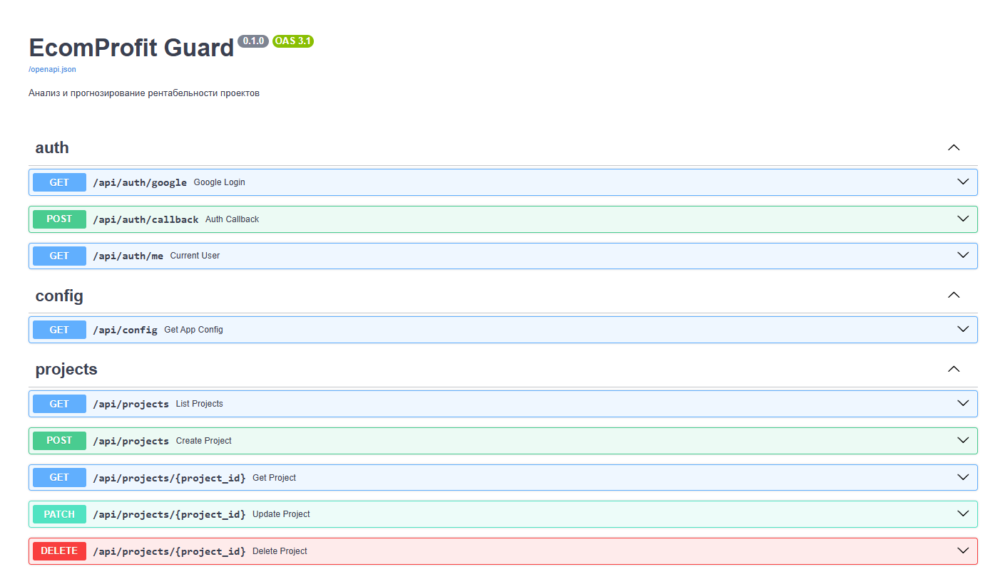

# Первичное тестирование (артефакты для задания 5П)

Здесь собраны материалы для отчёта: **скриншоты**, **логи**, **метрики**.

## Структура

| Путь | Содержание |
|------|------------|
| [metrics.md](metrics.md) | Таблица метрик качества прогноза и автотестов |
| [logs/example_pytest_run.txt](logs/example_pytest_run.txt) | Обезличенный вывод `pytest -v` для отчёта |
| [logs/example_forecast_response.json](logs/example_forecast_response.json) | Пример JSON: режим **ensemble** (ARIMA + CatBoost) |
| [logs/example_forecast_response_naive.json](logs/example_forecast_response_naive.json) | Пример JSON: режим **naive** при малой истории |
| `screenshots/*.png` | Скриншоты UI (набор ниже) |

## Логи и примеры ответов API

В репозитории уже лежат **готовые обезличенные** файлы в `logs/` (см. таблицу выше): числа и периоды условные, токенов и персональных данных нет. Их можно **приложить к отчёту** как образцы логов первичного тестирования.

Если сохраняете **свои** фрагменты ответов API с работающего стенда, по-прежнему вырезайте заголовок `Authorization`, токены и ФИО/контакты из тела; для прогноза достаточно структуры как в примерах JSON.

## Скриншоты интерфейса (функциональное тестирование)

Файлы в каталоге `screenshots/`. Ниже — вставки для просмотра в GitHub / VS Code и для включения в отчёт.

### 1. Вход через Google

### 2. Синхронизация

### 3. Дашборд

### 4. Аналитика

### 5. Прогноз

### 6. Алерты

### 7. Документация API (Swagger)

## Как обновить метрики

1. Автотесты backend: `cd backend` → `.\.venv\Scripts\python.exe -m pytest -v` (см. `metrics.md`, раздел 1).  
2. Запустите backend и фронтенд, выполните синхронизацию и постройте прогноз на тестовых данных.  
3. При необходимости добавьте логирование MAE/MAPE в `forecast_ml.py` на время прогона или зафиксируйте значения из отладки CatBoost (валидационная выборка).  
4. Заполните таблицы в `metrics.md`.  
5. При необходимости добавьте **свои** обезличенные логи рядом с готовыми в `logs/` (или оставьте только шаблоны из репозитория).

---

*Апрель 2026 г.*
